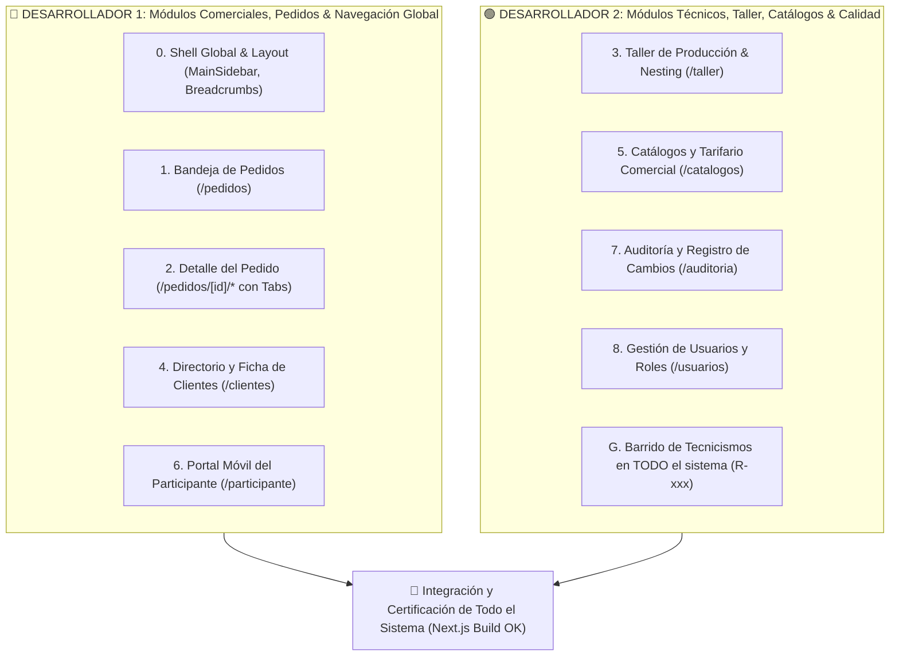
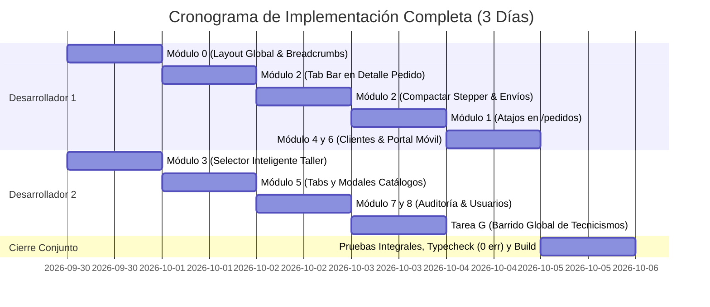

# 🎨 Plan Maestro de Optimización UX/UI y Ergonomía Visual — Frontend Completo SIPES

**Documento:** `plan_ui.md`  
**Alcance:** **100% de los módulos del Frontend** (`sipes-next`)  
**Rama base:** `feature/frontend`  
**Equipo:** 2 Desarrolladores en paralelo  
**Objetivo General:** Transformar todo el sistema de una interfaz técnica sobrecargada a un **ERP textil fluido, intuitivo, elegante y coherente en todas sus pantallas**.

---

## 🗺️ 1. Matriz de Cobertura de Todo el Frontend

Este plan no se limita al pedido: aborda **las 8 áreas completas del software** más el Layout Global del sistema:

| # | Módulo del Frontend | Ruta en App | Diagnóstico UX Actual | Objetivo del Rediseño |
| :-: | :--- | :--- | :--- | :--- |
| **0** | **Navegación Global & Shell** | `MainSidebar`, Layout | Falta el enlace a `/taller` en el menú; navegación entre rutas rígida. | Menú global unificado, breadcrumbs dinámicos y badge de alertas. |
| **1** | **Bandeja de Pedidos** | `/pedidos` | Filtros provocan parpadeo de skeleton; faltan atajos directos por fila. | Atajos directos a prendas/diseño/proforma; transición suave. |
| **2** | **Detalle de Pedido (Núcleo)** | `/pedidos/[id]/*` | Scroll vertical excesivo (>2000px); sub-pantallas aisladas con botón 'Volver'. | **Tab Bar Superior persistente (6 pestañas)**; compactación Stepper/Guía. |
| **3** | **Taller y Nesting (Planta)** | `/taller` | Pide escribir UUID manual en lugar de selector amigable. | Selector reactivo de pedidos activos; visualización clara de metros de tela. |
| **4** | **Clientes & Directorio** | `/clientes`, `[id]` | Buen diseño base, pero faltan métricas de deuda/anticipo en tarjetas. | Ficha 360° pulida con acceso inmediato a sus pedidos históricos. |
| **5** | **Catálogos & Tarifario** | `/catalogos` | Mucha densidad de texto técnico; modales con campos no agrupados. | Visualización con tabs claras (Telas, Cuellos, Cortes, Tarifas R-K10). |
| **6** | **Portal del Participante** | `/participante/[token]` | Funcional, pero en móviles requiere inputs numéricos más táctiles y rápidos. | Experiencia móvil impecable tipo formulario paso a paso sin fricción. |
| **7** | **Auditoría & Trazabilidad** | `/auditoria` | Tabla densa con JSONs crudos en algunos campos. | Línea de tiempo visual (Timeline) amigable para resolver reclamos. |
| **8** | **Usuarios & Seguridad** | `/usuarios` | Formulario plano sin explicación de permisos por rol. | Cards por rol con chips de permisos operativos explicados en español. |

---

## 👥 2. Asignación Equitativa de Todo el Frontend (2 Desarrolladores)

Para que los dos programadores trabajen sin pisarse el código en Git (*zero merge conflicts*), dividimos el sistema en **2 bloques simétricos**:

---

## 🛠️ 3. Plan Detallado por Módulos y Desarrollador

---

### 🔵 BLOQUE A: DESARROLLADOR 1 (Flujo Comercial, Pedido & Navegación)

#### Módulo 0: Navegación Global y Layout Base (`MainSidebar.tsx`, `Header`)
* **Problema:** En el menú lateral izquierdo no figura el acceso directo a `/taller`, y el usuario no tiene migas de pan (*breadcrumbs*) para saber en qué pedido o pantalla está navegando.
* **Acciones:**
  1. Agregar el enlace **Taller / Producción** (`/taller`) con ícono de fábrica (`Factory` de lucide-react) en `MainSidebar.tsx`.
  2. Implementar barra de migas de pan en la cabecera superior:  
     `Pedidos > SUB-000842 > Matriz de Prendas`.
  3. Badge de notificación dinámico en el menú cuando haya pedidos con alertas de taller pendientes de acuse (R-H14).

#### Módulo 1: Bandeja General de Pedidos (`/pedidos`)
* **Problema:** Para ir a ver las prendas o el diseño de un pedido, el usuario debe abrir el pedido, esperar la carga completa y luego buscar el botón hacia la sub-página. Al cambiar filtros, la tabla parpadea bruscamente.
* **Acciones:**
  1. **Atajos Rápidos por Fila (`PedidosTable.tsx`):**  
     Agregar una botonera flotante o menú contextual de 3 acciones en cada pedido:
     * 👕 *Prendas* (`/pedidos/[codigo]/prendas`)
     * 🎨 *Diseño* (`/pedidos/[codigo]/diseno`)
     * 💵 *Proforma* (`/pedidos/[codigo]/proforma`)
  2. **Transición Suave:** Sustituir el desmontado agresivo de la tabla por un overlay de carga suave (*opacity 0.6 con spinner sutil*) durante el filtrado por estados.

#### Módulo 2: Detalle de Pedido Unificado (`/pedidos/[id]/*`) — El Núcleo
* **Problema:** Scroll vertical kilométrico (>2000px) y sensación de pantallas desconectadas con flechitas sueltas de `← Volver a datos del pedido`.
* **Acciones:**
  1. **Tab Bar Superior (`PedidoTabs.tsx`):**
     Montar una barra de pestañas persistente que permanezca fija en la parte superior:
     * 📄 **Ficha General:** Identificación, grupos de prendas, telas y paleta de colores oficiales.
     * 👕 **Matriz de Prendas:** Carga de tallas, dorsales, nombres y excepciones.
     * 👥 **Participantes & WhatsApp:** Enlaces públicos, estado de llenado y fichas.
     * 🎨 **Arte & Mockups:** Subida de artes, vista previa y aprobación de diseño.
     * 🔒 **Calidad & Bloques:** Los 3 candados de fabricación y alertas de reapertura.
     * 💵 **Proforma:** Cotización detallada y botón para emitir confirmación oficial (R-K06).
  2. **Fusión Stepper + Guía de Etapa:**  
     Rediseñar `PedidoStepper` para que los requisitos de cada etapa se desplieguen de forma compacta (tipo acordeón o tooltip interactivo), liberando **más de 250 píxeles verticales**.
  3. **Exposición Progresiva de Envíos:**  
     Ocultar o colapsar la tarjeta de paquetería/despacho en etapa `BORRADOR` y desplegarla automáticamente cuando el pedido entra a `EN_PRODUCCION`.
  4. **Retirar enlaces sueltos:** Eliminar los textos `← Volver a datos del pedido` en todas las sub-vistas, ya que el Tab Bar se encarga de la navegación fluida.

#### Módulo 4: Clientes y Directorio (`/clientes`, `/clientes/[id]`)
* **Problema:** El módulo es bueno, pero la vista de detalle carece de accesos rápidos a la creación de un nuevo pedido para ese cliente específico.
* **Acciones:**
  1. En `ClienteDetalleView.tsx`, agregar botón destacado: **`+ Crear Pedido para este Cliente`**.
  2. Indicador visual del estado del cliente (Activo / Histórico) y resumen de pedidos en curso.

#### Módulo 6: Portal Público del Participante (`/participante/[token]`)
* **Problema:** En teléfonos móviles, los campos de número y talla deben ser ultra-rápidos de llenar para jugadores en vestuarios o clientes no técnicos.
* **Acciones:**
  1. Botones táctiles grandes para selección de talla (chips clicables tipo `[ S ] [ M ] [ L ] [ XL ]`) en lugar de selects pequeños.
  2. Teclado numérico automático para el dorsal (`inputMode="numeric"`).
  3. Mensaje de confirmación visual celebratorio con ícono de éxito al guardar la ficha.

---

### 🟢 BLOQUE B: DESARROLLADOR 2 (Taller, Catálogos, Auditoría & Lenguaje)

#### Módulo 3: Taller de Producción y Nesting (`/taller`)
* **Problema:** Solicita escribir un UUID manual en texto plano para asociar pedidos al rollo de tela, y faltan validaciones visuales de metros.
* **Acciones:**
  1. **Selector Inteligente (`SelectorPedidoProduccion.tsx`):**  
     Reemplazar el input libre por un combobox con buscador que liste pedidos en estado `EN_PRODUCCION` o `EN_REVISION`:  
     `[SUB-000842 · Promo 2002 - Colegio San José · 28 prendas · Entrega: 15 Oct]`.
  2. **Medidor Visual de Tela:**  
     Barra de progreso visual que muestre el ancho estándar de **1.80 metros** y el porcentaje ocupado del rollo para evitar merma textil.
  3. **Archivos TIF en Serie:** Mostrar claramente la división de archivos técnicos (máximo 5 metros por archivo según regla R-K13) con botón de descarga directa.

#### Módulo 5: Catálogos Técnicos y Tarifario Comercial (`/catalogos`)
* **Problema:** La configuración técnica está mezclada y puede intimidar a usuarios comerciales novatos.
* **Acciones:**
  1. Separación limpia en pestañas internas:
     * 👕 **Prendas Base:** Camisetas, shorts, medias físicas con selector numérico (Regla R-K03).
     * 🧵 **Telas y Atributos:** Telas autorizadas, tipos de cuellos y cortes.
     * 🏷️ **Zonas de Estampado:** Pecho, espalda, mangas, cuello.
     * 💰 **Tarifario Vigente:** Tabla de costos base y recargos con fechas de vigencia (Regla R-K10).
  2. Modales de creación (`ModalNuevoTipoProducto`, `ModalNuevaTela`) con textos de ayuda contextual ("Ej: Dry-Fit Win, Piqué, etc.").

#### Módulo 7: Auditoría y Registro de Cambios (`/auditoria`)
* **Problema:** Se muestran valores técnicos que parecen de base de datos (`entidad: Prenda`, `origen: PARTICIPANTE`, timestamps en UTC sin formato amigable).
* **Acciones:**
  1. Formateo de fechas relativo ("Hace 10 minutos", "Ayer a las 4:15 PM").
  2. Traducción de orígenes a badges visuales limpios:
     * 🟢 **Cliente / Jugador** (vía WhatsApp)
     * 🔵 **Oficina / Vendedora**
     * 🟣 **Sistema Automático**
  3. Comparador visual de cambios: Mostrar claramente `Valor Anterior ➔ Valor Nuevo` con colores rojo y verde.

#### Módulo 8: Gestión de Usuarios y Roles (`/usuarios`)
* **Problema:** Los roles se muestran en mayúsculas técnicas (`COORDINADOR_CLIENTE`, `DISENO`, `PRODUCCION`) sin explicar qué puede o no hacer cada uno.
* **Acciones:**
  1. Reemplazar los textos en mayúsculas por nombres profesionales: *Diseño Gráfico*, *Taller de Producción*, *Ventas / Recepción*, *Administración*.
  2. Al crear o editar un usuario, mostrar un resumen visual de permisos: *"Este usuario podrá aprobar artes, subir vectores y ver mockups"*.

#### Tarea Transversal G: Erradicación Global de Tecnicismos de Código
* **Problema:** Hay fugas de abstracciones internas en botones, modales y tarjetas (`R-A09`, `R-K11`, `R-B02`, `(BASE DE DATOS)`).
* **Acciones:**
  1. Barrer y reemplazar todos los códigos `(R-xxx)` por lenguaje natural de negocio en todos los componentes.
  2. En `PedidoRevision.tsx`: Cambiar `GOBERNANZA DE BLOQUES OPERATIVOS (BASE DE DATOS)` por **`Control de Calidad y Bloques de Fabricación`**.
  3. Cambiar mensajes de error crudos de la API por notificaciones amigables en español.

---

## 🗓️ 4. Cronograma de Ejecución y Sincronización

---

## 🎯 5. Criterios de Aceptación Global (Definition of Done)

Al finalizar este plan, el frontend completo cumplirá con los siguientes estándares:

1. **Navegación Unificada:** El usuario se desplaza por los 8 módulos y dentro de cada pedido usando pestañas y menús visuales, sin recurrir al botón de retroceso del navegador.
2. **Cero Tecnicismos en Pantalla:** Ningún cliente ni operario verá palabras como `UUID`, `BASE DE DATOS`, `entidad`, ni códigos como `(R-A09)` o `(R-K11)`.
3. **Consistencia Visual:** Todos los módulos respetan la misma tipografía Inter, paleta `#0c2333` / `#0284c7`, bordes redondeados y micro-interacciones.
4. **Calidad Técnica Impecable:**
   * `npm run typecheck` en **0 errores**.
   * `npm run lint` en **0 errores**.
   * `npm run build` en compilación de producción exitosa en menos de 15 segundos.
